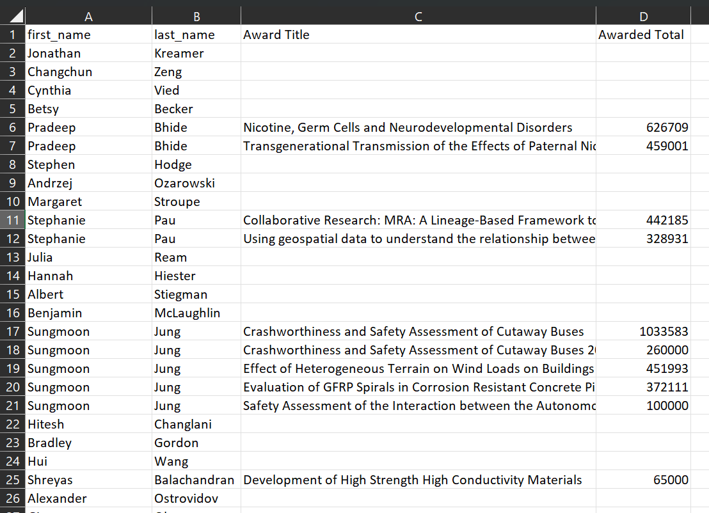
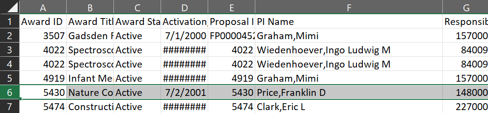
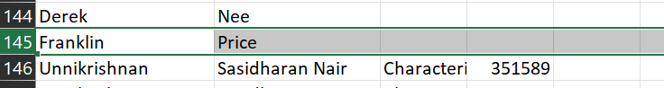

# RCC - Parsing CSV data

## Steps to run,
1. `poetry shell`
2. `poetry install`
3. `poetry run src/main.py`

## Description
1. This script reads data from the `assets/rcc_award_detail.csv` and `assets/rcc_faculty.csv`.
2. From the `rcc_award_detail.csv`, finds the sum of awarded money, grouped by PI name and award title.
3. Groups this aggregated data with the professor names in `rcc_faculty.csv`.
4. The grouping is done on left outer join, meaning all the names of the professors are in the final list, but the awards which are not mapped to any professor is left out.
5. The result is displayed in STDOUT and the same results are also omitted to a `result.csv` file.

## Important!!
- If professor names do not match in the CSVs, the data will not be matched properly.
- Example from the data files -
    * Notice the `PI Name` in the awards CSV file, ie., `Price,Franklin D`,
    
    * Notice the `first_name` In the professor CSV file, the first name is only `Franklin` and the `D` is left out,
    
    * As there is a mismatch in names, these records are not mapped together,
    
